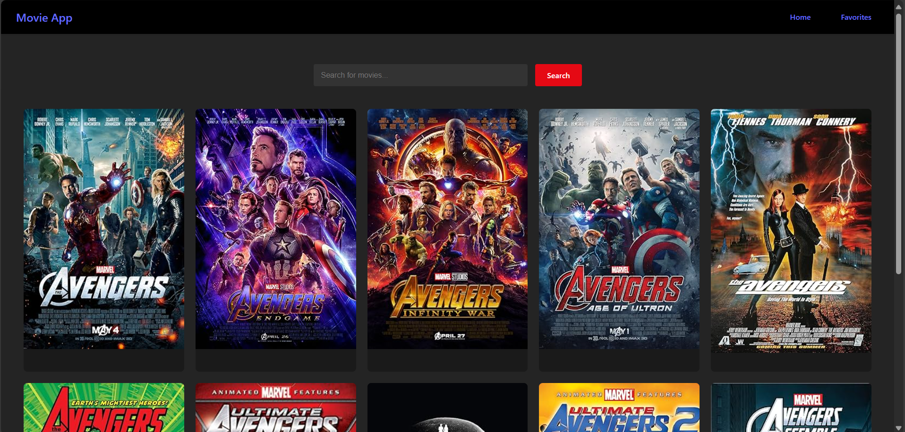
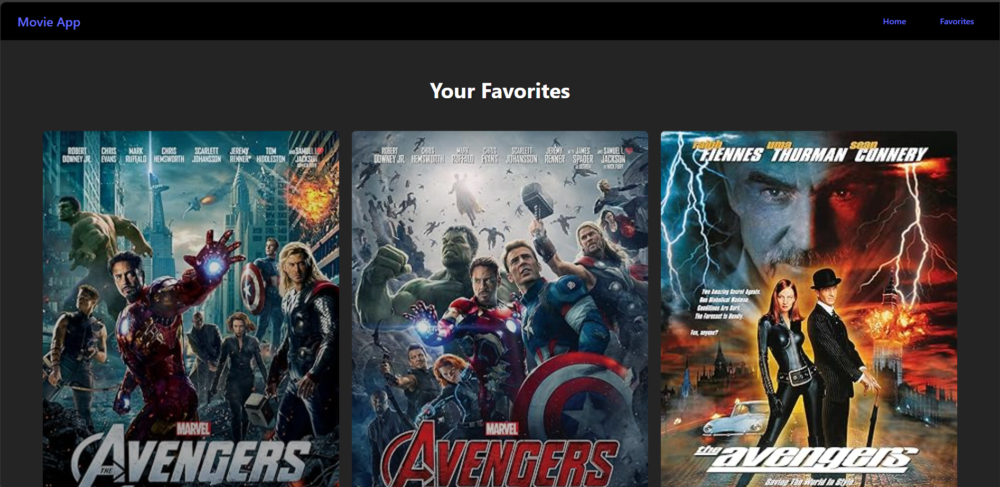
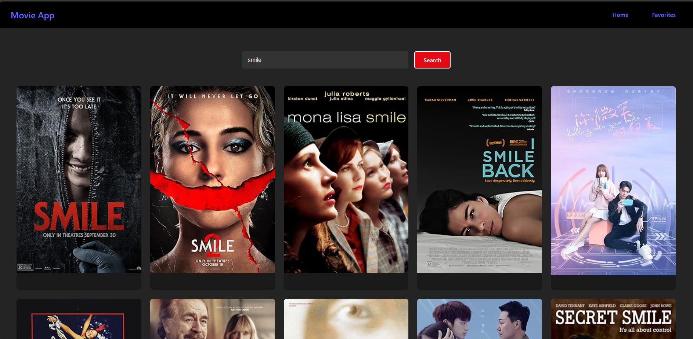

# 🎬 Movie App with OMDb API

A simple movie search and favorite application built with React and the OMDb API. Users can search for movies, view posters, and save their favorite movies locally.

## 🚀 Features

- 🔍 Search movies by title using OMDb API
- ❤️ Add or remove movies from favorites
- 💾 Favorites saved in browser (localStorage)
- 🎨 Clean and responsive UI with React components

## 🛠️ Tech Stack

- React (Functional Components + Hooks)
- React Router DOM
- Context API for global state
- OMDb API (Open Movie Database)
- CSS

